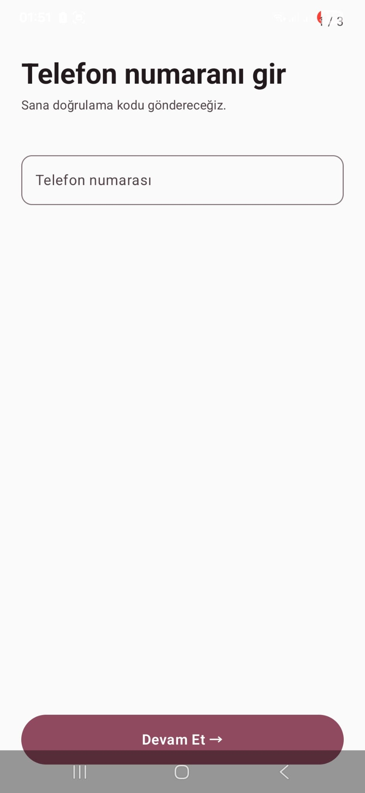
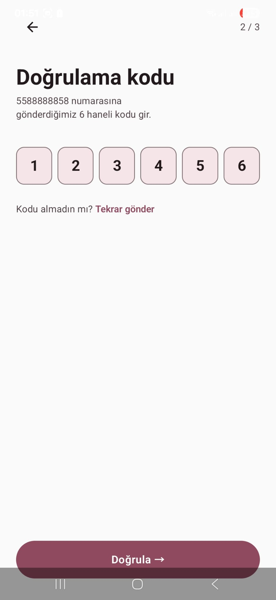
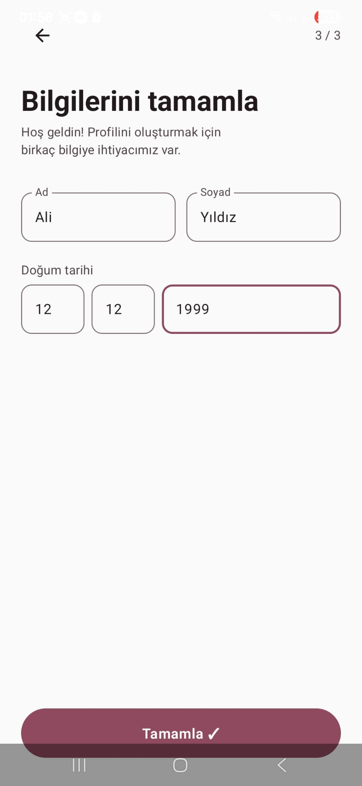
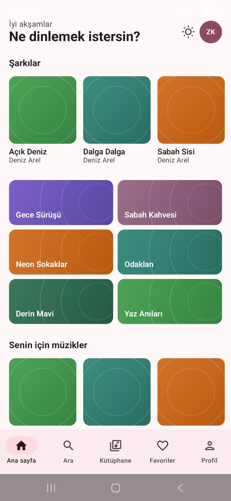
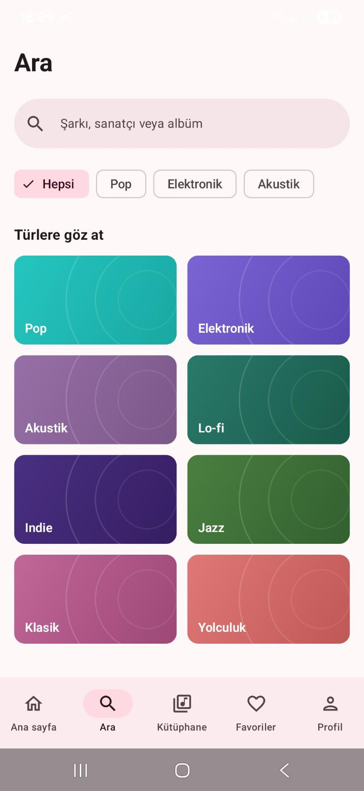
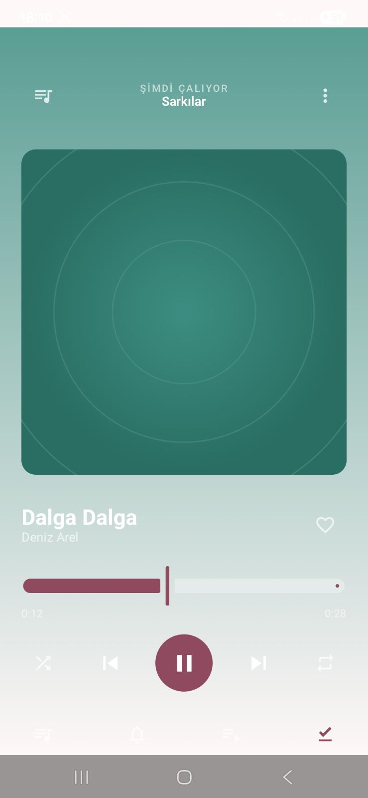
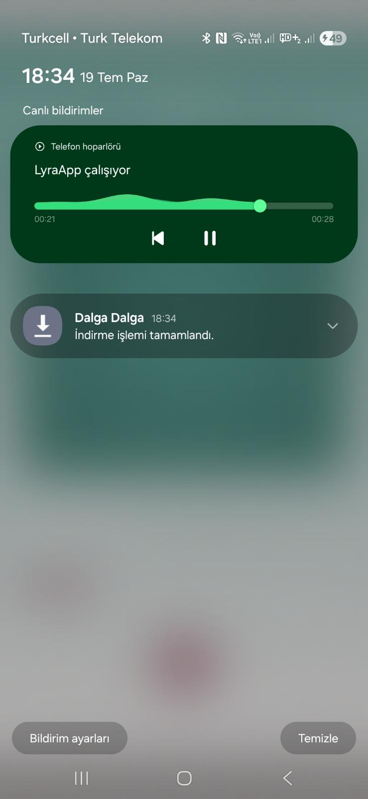
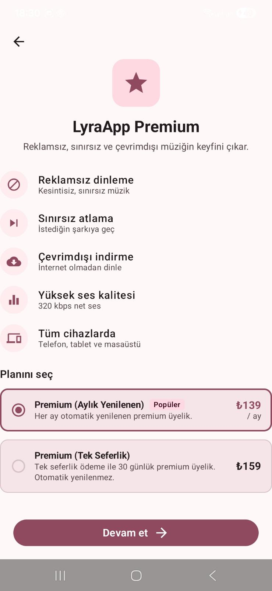
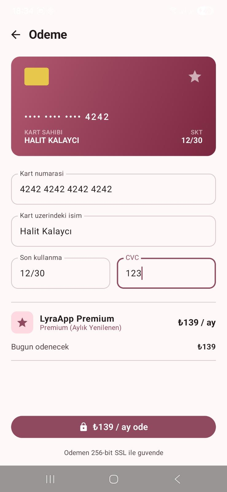

# LyraApp


LyraApp, çevrimiçi ve çevrimdışı müzik dinleme deneyimi sunan bir Android uygulamasıdır. Uygulama Jetpack Compose ile geliştirilmekte olup MVI (Model-View-Intent) mimarisini temel alır ve RESTful bir API üzerinden çalışır.

---

## İçindekiler

- [Genel Bakış](#genel-bakış)
- [Ekran Görüntüleri](#ekran-görüntüleri)
- [Özellikler](#özellikler)
- [Mimari](#mimari)
- [Teknoloji Yığını](#teknoloji-yığını)
- [Proje Yapısı](#proje-yapısı)
- [Backend / API](#backend--api)
- [Kurulum](#kurulum)

## Genel Bakış

| Bilgi | Değer |
|---|---|
| Platform | Android (Jetpack Compose, Kotlin) |
| Paket adı | `com.turkcell.lyraapp` |
| Minimum SDK | 24 |
| Hedef SDK | 36 |
| Derleme SDK | 36 |
| Mimari | MVI (Model-View-Intent) |
| Bağımlılık enjeksiyonu | Hilt |
| Ağ katmanı | Retrofit + OkHttp |
| Medya oynatma | Media3 (ExoPlayer) |
| Backend | RESTful API (JWT kimlik doğrulama, imzalı ses akışı) |

---

## Ekran Görüntüleri

Aşağıdaki ekran görüntüleri uygulamanın temel akışlarını göstermektedir.

**Kimlik Doğrulama**

|  |  |  |
|:---:|:---:|:---:|
| Telefon Girişi | Doğrulama Kodu | Profili Tamamla |

**Ana Akış ve Oynatma**

|  |  |  |
|:---:|:---:|:---:|
| Ana Sayfa | Arama | Şimdi Çalıyor |

**Premium ve Ödeme**

|  |  |  |
|:---:|:---:|:---:|
| Kilit Ekranı Bildirimi | Premium Üyelik Planları | Ödeme |

---

## Özellikler

- Telefon numarası ve OTP doğrulaması ile kimlik doğrulama, JWT erişim/yenileme token yönetimi.
- Ana sayfada ruh haline göre gruplandırılmış çalma listeleri ve kullanıcıya özel öneriler.
- Şarkı, sanatçı ve tür bazlı arama; tür kategorilerine göz atma.
- Arka planda kesintisiz müzik oynatma (Media3 / ExoPlayer tabanlı ön planda servis).
- Kilit ekranı ve bildirim çubuğundan medya kontrolü (oynat, duraklat, sonraki/önceki parça).
- Çevrimdışı dinleme için parça indirme desteği.
- Kütüphane, favoriler ve kullanıcı tarafından oluşturulan çalma listeleri.
- LyraApp Premium üyelik planları ve mock kart ödemesi ile satın alma akışı.
- Ücretsiz kullanıcılar için periyodik reklam mantığı; premium kullanıcılar için reklamsız dinleme (backend tarafından yönetilir).
- Kullanıcı profili görüntüleme ve profil tamamlama akışı.
- Açık ve koyu tema desteği; sabit marka renk paleti (dinamik renk kapalıdır).

---

## Mimari

Uygulama, tek yönlü veri akışını zorunlu kılan MVI (Model-View-Intent) mimarisini kullanır. Her ekran State, Intent ve Effect üçlüsü ile modellenir:

```
Kullanıcı -> Intent -> ViewModel -> State (arayüz güncellenir)
                                  -> Effect (tek seferlik yan etki: navigasyon, mesaj vb.)
```

Her özellik (feature) aşağıdaki klasör şablonunu takip eder:

```
app/src/main/java/com/turkcell/lyraapp/
├── data/
│   └── <feature>/
│       ├── <Feature>Repository.kt        (interface)
│       └── Fake<Feature>Repository.kt    (stub implementasyon)
├── di/
│   └── <Feature>Module.kt                (Hilt binding modülü)
└── ui/
    └── screens/
        └── <feature>/
            ├── <Feature>Contract.kt      (State + Intent + Effect)
            ├── <Feature>ViewModel.kt
            └── <Feature>Screen.kt        (Route + Screen)
```

Her ekran, durumu tutan ve Hilt üzerinden ViewModel'e bağlanan bir `Route` (stateful) composable'ı ile yalnızca state ve intent alan, önizlenebilir bir `Screen` (stateless) composable'ından oluşur.

Backend entegrasyonu tamamlanana kadar özellikler `FakeRepository` implementasyonları üzerinden geliştirilir; gerçek API hazır olduğunda yalnızca ilgili `di/<Feature>Module.kt` dosyası güncellenir, ViewModel ve Screen katmanlarına dokunulmaz.

Mimari kararların ayrıntılı gerekçeleri için:

- `docs/architecture/mvi-overview.md`
- `docs/architecture/mvi-contracts.md`
- `docs/architecture/mvi-viewmodel-rules.md`
- `docs/decisions.md`

---

## Teknoloji Yığını

| Kütüphane | Versiyon | Amaç |
|---|---|---|
| Kotlin | 2.2.10 | Uygulama dili |
| Jetpack Compose BOM | 2026.02.01 | Arayüz katmanı |
| Material 3 | Compose BOM ile uyumlu | Tasarım sistemi bileşenleri |
| Hilt | 2.59.2 | Bağımlılık enjeksiyonu |
| KSP | 2.2.10-2.0.2 | Hilt için annotation processing |
| Retrofit | 2.11.0 | HTTP istemcisi |
| OkHttp | 4.12.0 | Ağ katmanı ve interceptor'lar |
| Media3 (ExoPlayer, Session) | 1.5.1 | Ses oynatma ve medya oturumu |
| AndroidX Security Crypto | 1.0.0 | Token'ların şifreli saklanması |
| AGP | 9.2.1 | Android Gradle Plugin |

---

## Proje Yapısı

Uygulama içerisinde yer alan başlıca ekranlar:

| Katman | Ekranlar |
|---|---|
| Kimlik doğrulama | Telefon girişi, OTP doğrulama, profil tamamlama |
| Ana akış | Ana sayfa, arama, kütüphane, favoriler, çalma listesi detayı, çalma listesi oluşturma |
| Oynatma | Şimdi çalıyor, bildirim/kilit ekranı medya kontrolü |
| Üyelik | Üyelik planları, ödeme (checkout) |
| Profil | Profil görüntüleme |

Veri katmanındaki başlıca modüller: `auth`, `home`, `search`, `library`, `favorites`, `playlistdetail`, `createplaylist`, `nowplaying`, `player`, `download`, `membership`, `profile`, `user`.

---

## Backend / API

Uygulama, `docs/api/openapi.json` dosyasında tanımlı olan RESTful bir API'yi tüketir.

| Etiket | Açıklama |
|---|---|
| auth | Mock OTP ile telefon numarası tabanlı kimlik doğrulama, JWT erişim/yenileme token'ları |
| me | Oturum açmış kullanıcıya özel uç noktalar (Bearer token gerektirir) |
| memberships | Premium planlar ve mock kart ödemesi ile satın alma; fiyat kataloğu herkese açık, ödeme Bearer token gerektirir |
| playback | Sıradaki içeriği belirleyen sunucu taraflı mantık; ücretsiz kullanıcılara her 3 şarkıda bir reklam |
| songs | Şarkı kataloğu |
| playlists | Herkese açık / öne çıkan çalma listeleri |
| stream | İmzalı, Range (HTTP 206) destekli ses akışı; ExoPlayer'ın atlama (seek) özelliği için gereklidir |
| meta | Servis sağlık kontrolü |

Kimlik doğrulama dışındaki tüm isteklere `Authorization: Bearer <accessToken>` başlığı eklenir; 401 yanıtında refresh token ile bir kez otomatik yenileme denemesi yapılır (bkz. `di/NetworkModule.kt`).

---

## Kurulum

### Gereksinimler

- Android Studio (güncel kararlı sürüm)
- JDK 11
- Android SDK 36 (minimum SDK 24)

### Adımlar

```
git clone https://github.com/Ozansis/turkcell-gygy5-LyraApp-Pair.git
cd turkcell-gygy5-LyraApp-Pair
```

Projeyi Android Studio ile açın ve Gradle senkronizasyonunun tamamlanmasını bekleyin. Ardından uygulamayı bir emülatör veya fiziksel cihazda çalıştırın:

```
./gradlew assembleDebug
```

Backend API adresi `di/NetworkModule.kt` içerisinde sabit olarak tanımlıdır; farklı bir ortama bağlanmak için bu dosyanın güncellenmesi gerekir.
